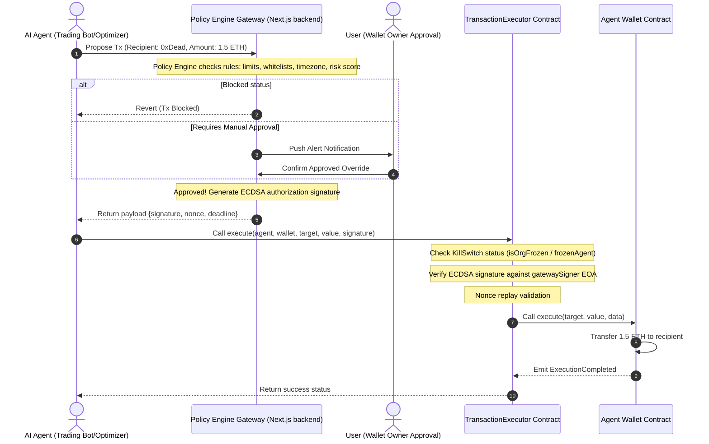

# AgentShield Hackathon Submission Assets

This asset file compiles materials to support the final live pitch, codebase walk-throughs, and judge evaluations.

---

## 1. Sequence Diagram: Cryptographic Transaction Execution Loop

---

## 2. Presentation Slide talking points

### Slide 1: The Problem — AI Agents are Draining Wallets
- **Hook**: AI agents are no longer just writing code or summarizing text; they are executing transactions, calling smart contracts, and paying API billing.
- **The Gap**: What happens when an agent hallucinates, experiences API loops, or is hijacked? It drains the associated EOA wallets instantly. Standard multisig wallets require manual signatures, defeating the autonomy of AI agents.

### Slide 2: The Solution — AgentShield
- **The Concept**: A secure co-signing platform offering **deterministic off-chain governance** combined with **on-chain execution control**.
- **Real-Time Guardrails**: Limits caps, Whitelists addresses, business hour locks, and dynamic risk scorings.

### Slide 3: Cryptographic Signature Architecture
- **On-chain Enforcement**: The smart contract wallet strictly rejects any transaction that doesn't include an ECDSA authorization signature generated by the Policy Engine gateway.
- **Result**: Even if the AI agent's private keys leak, hackers cannot spend funds because the on-chain gateway blocks any calls bypassing policy limits.

### Slide 4: Real-time Emergency SOC & Kill Switch
- **Automatic Halts**: If a transaction triggers a risk score >= 80, the system automatically fires the global Kill Switch, freezing wallets and pausing all agents.
- **Manual Overrides**: Owners can halt operations immediately using the dashboard toggle.

---

## 3. Judge FAQs

### Q1: Why not run the policy engine on-chain in Solidity?
- **Answer**: Gas limits and database checks. Querying transaction counts, evaluating rapid frequency, and running complex AI analysis scores on-chain is cost-prohibitive. Off-chain validation with cryptographically signed executions ensures sub-cent execution speed and zero gas costs for rules checks.

### Q2: If the backend gateway key is compromised, is the wallet secure?
- **Answer**: The smart contract wallet `AgentWallet.sol` has a registered recovery owner key (the human controller's hardware wallet). The owner can call `recoveryWithdraw()` to bypass the executor and withdraw all treasury assets in case of a backend compromise.

### Q3: How does the platform scale to Base or Polygon networks?
- **Answer**: Since the validation is off-chain, the policy engine is network-agnostic. The `TransactionExecutor` only needs to be deployed on the target networks (Polygon, Base). Nonce replay checks are tracked independently per wallet address on-chain.
