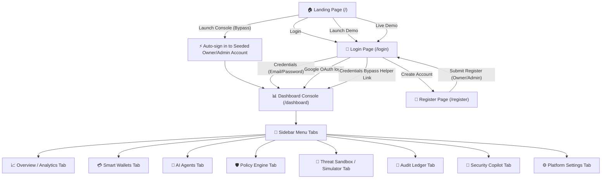

# AgentShield - Website Flow Guide

This document maps out the complete user journey, navigation pathways, tab menus, and interactive control buttons across the **AgentShield** platform.

---

## 🗺️ System Navigation Tree

---

## 🏛️ Flow Breakdown by Page

### 1. Landing Page (`/`)
*   **Navigation Header Options**:
    *   **Logo / Brand Name**: Re-routes back to Landing Page (`/`).
    *   **Features / Architecture / Workflow / Tech Stack / FAQ**: Smooth scrolling anchors.
    *   **Login**: Redirects directly to `/login`.
    *   **Launch Console**: Direct **bypass flow** that logs the user into a pre-seeded **Admin/Owner Account** using preset mock credentials, allowing instant sandbox access.
*   **Hero Call-to-Actions**:
    *   **Launch Demo**: Redirects to the login route.
    *   **Live Demo**: Redirects to the login route.

### 2. Login Page (`/login`) & Registration Page (`/register`)
*   **Auth Entry Points**:
    *   **Credentials Sign In**: Enter registered email and password.
    *   **Seeded Admin Bypass Helper**: Clicking this link fills in pre-seeded admin/owner credentials (e.g. `admin@agentshield.com` or similar preset mock profiles) and automatically logs the user in.
    *   **Google OAuth Sign In**: Initiates Google authentication (with pkce/state checks resolved for Vercel).
    *   **Create Account Link**: Redirects to `/register`.
*   **Registration Page Options**:
    *   Create a profile by inputting Name, Email, Password, and selecting a **Governing Role**:
        *   **Owner (Master Controller)**: Holds full signature control, wallet configuration, and override privileges.
        *   **Admin (Read/Write Manager)**: Holds operational configuration views but cannot bypass global freezes or trigger master key recovery.

---

## 📂 Dashboard Tab Interactions Tree

```mermaid
graph TD
    DashboardPage["📊 Dashboard Root (/dashboard)"]
    
    %% Overview
    DashboardPage --> Overview["📈 Overview / Analytics Tab"]
    Overview --> O1["➕ Register Wallet Button"]
    Overview --> O2["🔒 Freeze Wallet Card Action"]
    Overview --> O3["🔓 Unfreeze Wallet Card Action"]
    Overview --> O4["🔔 Alerts Stream Card Notification"]
    
    %% Wallets
    DashboardPage --> Wallets["💳 Smart Wallets Tab"]
    Wallets --> W1["🔌 Simulate Wallet Connection (MetaMask)"]
    Wallets --> W2["🚀 Deploy smart contract wallets (ERC-4337)"]
    Wallets --> W3["❄️ Freeze Keys (Multi-sig/EOA)"]
    Wallets --> W4["💸 Trigger Recovery Withdrawal (Master EOA rescue)"]
    
    %% AI Agents
    DashboardPage --> Agents["🤖 AI Agents Tab"]
    Agents --> A1["🔧 Configure (Edit individual agent limits)"]
    Agents --> A2["⏸️ Pause / Start (Toggle agent state)"]
    Agents --> A3["🛑 Suspend (Completely block agent API)"]
    Agents --> A4["⚡ Propose Transaction (Manual prompt trigger)"]
    Agents --> A5["🆕 Deploy Governed AI Agent (Modal Form)"]
    
    %% Policies
    DashboardPage --> Policies["🛡️ Policy Engine Tab"]
    Policies --> P1["💵 Edit Single Tx Limit Cap"]
    Policies --> P2["📆 Toggle Weekend Locks"]
    Policies --> P3["📋 Configure Token Whitelists / Blacklists"]
    Policies --> P4["📊 Adjust Max Risk Score Thresholds"]
    Policies --> P5["➕ Create Policy (Define custom rules)"]
    
    %% Simulator
    DashboardPage --> Simulator["🚨 Threat Sandbox / Simulator Tab"]
    Simulator --> S1["🟢 Execute Safe Payment (0.05 ETH billing scenario)"]
    Simulator --> S2["🟡 Trigger Anomaly (1.95 ETH payout warning scenario)"]
    Simulator --> S3["🔴 Trigger Policy Block (0xdead blacklisted wallet scenario)"]
    Simulator --> S4["💀 Trigger Wallet Drain (50 ETH critical heist scenario -> Auto Kill Switch!)"]
    Simulator --> S5["🚨 Activate Kill Switch Modal (Manual global halt)"]
    Simulator --> S6["🔓 Deactivate Kill Switch Modal (Emergency recovery)"]
    
    %% Audit Ledger
    DashboardPage --> Audit["📜 Audit Ledger Tab"]
    Audit --> AU1["🔍 Filter Logs by Status (Approved / Blocked)"]
    Audit --> AU2["🔎 Search by TX hash / Wallet Address"]
    Audit --> AU3["🧠 View Gemini Security grounding log analysis (Modal)"]
    
    %% Security Copilot
    DashboardPage --> Copilot["💬 Security Copilot Tab"]
    Copilot --> C1["🤖 Active Model Status Indicator (Google Gemini 1.5 Flash)"]
    Copilot --> C2["💡 Preset Query Cards (Auto-drafting limits / Log audit requests)"]
    Copilot --> C3["✉️ Input Message Text Box & Send Button"]
    
    %% Platform Settings
    DashboardPage --> Settings["⚙️ Platform Settings Tab"]
    Settings --> ST1["🎛️ Toggle Execution Mode (Demo vs Live Mode)"]
    Settings --> ST2["🔄 Toggle Lyzr AI Agent Connection"]
    Settings --> ST3["🧠 Toggle Gemini Evaluation Grounding"]
    Settings --> ST4["🧼 Reset Demo Environment (Scrub & Seed database)"]
```

---

## 🛡️ Live Mode vs. Demo Mode Behaviors

The system execution characteristics change dynamically depending on the selected mode:

| Component | Demo Mode 🟡 | Live Mode 🟢 |
| :--- | :--- | :--- |
| **Transaction Ingestion** | Local simulated scheduler ticks generate automatic activity logs every 8 seconds. | Automated scheduler ticks are disabled. The system waits for real webhook transaction proposals. |
| **Live Runner Wizard** | Runs step-by-step Sandbox tutorials, database resets, and seeds organization data. | Runs active transaction pipelines using live user parameters and prompts real Lyzr agents. |
| **Transaction Proposal** | Triggers mock payloads. | Queries live Lyzr AI agent runtimes to draft transaction payloads. |
| **Execution** | Simulation updates database entries. | Co-signs transaction requests and triggers Sepolia testnet execution via contract interfaces. |
