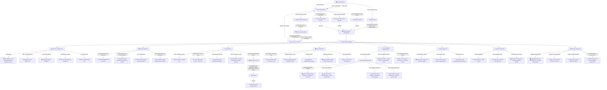

# AgentShield - Website Flow Diagram

```mermaid
graph TD
    %% ---------------------------------------------------
    %% 1. ENTRY POINT & AUTHENTICATION FLOW
    %% ---------------------------------------------------
    Landing["🏠 Landing Page (/)"]
    
    %% Landing Page Actions
    Landing --> |"Click 'Login'"| LoginPage["🔐 Login Page (/login)"]
    Landing --> |"Click 'Launch Demo'"| LoginPage
    Landing --> |"Click 'Live Demo'"| LoginPage
    Landing --> |"Click 'Launch Console'"| LaunchConsoleBypass["⚡ Bypass Login"]
    
    %% Bypass Flow
    LaunchConsoleBypass --> |"Auto-signs into Seeded Demo Account (Admin/Owner)"| Dashboard["📊 Dashboard Root (/dashboard)"]

    %% Login Page Options
    LoginPage --> |"Direct Email & Password Sign In"| FormAuth["🔑 Validate Credentials"]
    LoginPage --> |"Click 'Sign In with Google'"| GoogleOAuth["🌐 Google OAuth (Checks Bypass)"]
    LoginPage --> |"Click 'Preset Admin Credentials'"| PresetAuth["👤 Pre-fill Seeded Admin Account"]
    LoginPage --> |"Click 'Create an account'"| RegisterPage["📝 Register Page (/register)"]
    
    %% Registration Actions
    RegisterPage --> |"Enter Name, Email, Password"| RegisterRoleSelect["🎭 Select Governing Role"]
    RegisterRoleSelect --> |"Choose 'Owner' (Master Privileges)"| RegisterSubmit["Submit Account Creation"]
    RegisterRoleSelect --> |"Choose 'Admin' (Read-Write Operator)"| RegisterSubmit
    RegisterSubmit --> |"Redirects on success"| LoginPage

    %% Validation Results
    FormAuth --> |"Success"| Dashboard
    GoogleOAuth --> |"Success"| Dashboard
    PresetAuth --> |"Success"| Dashboard

    %% ----------------------------------------------------
    %% 2. DASHBOARD MAIN SIDEBAR TABS
    %% ----------------------------------------------------
    Dashboard --> SidebarTabs["📂 Sidebar Menu Navigation"]
    
    SidebarTabs --> TabOverview["📈 Overview / Analytics Tab"]
    SidebarTabs --> TabWallets["💳 Smart Wallets Tab"]
    SidebarTabs --> TabAgents["🤖 AI Agents Tab"]
    SidebarTabs --> TabPolicies["🛡️ Policy Engine Tab"]
    SidebarTabs --> TabSimulator["🚨 Threat Sandbox / Simulator Tab"]
    SidebarTabs --> TabAudit["📜 Audit Ledger Tab"]
    SidebarTabs --> TabCopilot["💬 Security Copilot Tab"]
    SidebarTabs --> TabSettings["⚙️ Platform Settings Tab"]

    %% ----------------------------------------------------
    %% 3. TAB 1: OVERVIEW / ANALYTICS
    %% ----------------------------------------------------
    TabOverview --> |"View metrics"| MetricsCards["📊 Total Wallets, Active Agents, Blocked Tx, Governance Score"]
    TabOverview --> |"Click '+ Register Wallet'"| OverviewRegWallet["➕ Redirect to Smart Wallets Tab"]
    TabOverview --> |"Click 'Freeze Wallet'"| OverviewFreeze["🔒 Halt wallet signature validations"]
    TabOverview --> |"Click 'Unfreeze Wallet'"| OverviewUnfreeze["🔓 Resume wallet signature validations"]
    TabOverview --> |"Click Alerts Card"| OverviewAlerts["🔔 Redirect to Audit Ledger Tab"]

    %% ----------------------------------------------------
    %% 4. TAB 2: SMART WALLETS
    %% ----------------------------------------------------
    TabWallets --> |"Click 'Simulate Wallet Connection'"| WalletConnect["🔌 Initialize MetaMask EIP-1193 Link"]
    TabWallets --> |"Click 'Deploy Smart Contract Wallets'"| WalletDeploy["🚀 Deploys ERC-4337 Smart Account proxies on Sepolia"]
    TabWallets --> |"Click 'Freeze Keys'"| WalletFreezeKeys["❄️ Revokes active private key authorizations"]
    TabWallets --> |"Click 'Trigger Recovery Withdrawal'"| WalletRescue["💸 Drain contract assets to Master EOA cold wallet"]

    %% ----------------------------------------------------
    %% 5. TAB 3: AI AGENTS
    %% ----------------------------------------------------
    TabAgents --> |"Click 'Configure' on Card"| AgentConfigure["🔧 Redirect to Policy Engine Tab"]
    TabAgents --> |"Click 'Pause' / 'Start' on Card"| AgentToggleStatus["⏸️ Switch agent state active <-> paused"]
    TabAgents --> |"Click 'Suspend' on Card"| AgentSuspend["🛑 Revoke agent API credentials completely"]
    TabAgents --> |"Click '⚡ Propose' on Card"| AgentManualPropose["⚡ Prompt agent to compile and submit transaction proposal"]
    TabAgents --> |"Click 'Deploy Governed AI Agent'"| AgentDeployModal["🆕 Open setup modal"]
    
    %% Deploy Agent Modal Actions
    AgentDeployModal --> |"Input Agent Name, description, wallet, spending limit, allowed tokens"| AgentDeploySubmit["Submit Form"]
    AgentDeploySubmit --> |"Success"| AgentDeployOutput["🔑 Display Generated Secret API Key"]

    %% ----------------------------------------------------
    %% 6. TAB 4: POLICY ENGINE
    %% ----------------------------------------------------
    TabPolicies --> |"Input 'Single Transaction Cap'"| PolicyCap["💵 Limit maximum single transaction value"]
    TabPolicies --> |"Toggle 'Weekend Locks'"| PolicyWeekend["calendar Toggles Weekend transaction blocks"]
    TabPolicies --> |"Edit Token Lists"| PolicyTokens["📋 Add/remove allowed/blocked tokens"]
    TabPolicies --> |"Slide 'Max Risk Score'"| PolicyRiskCap["📊 Adjust Gemini-evaluated risk threshold (0-100)"]
    TabPolicies --> |"Click 'Create Policy'"| PolicyCreateModal["➕ Open custom policy rules designer"]

    %% ----------------------------------------------------
    %% 7. TAB 5: THREAT SANDBOX / SIMULATOR
    %% ----------------------------------------------------
    TabSimulator --> |"Select Agent dropdown"| SimChooseAgent["Select target agent profile"]
    
    %% Simulator Scenarios
    SimChooseAgent --> |"Click 'Execute Safe Payment'"| SimSafe["🟢 Submit 0.05 ETH billing request -> Cosigned & Executed"]
    SimChooseAgent --> |"Click 'Trigger Anomaly'"| SimAnomaly["🟡 Submit 1.95 ETH warning request -> Alert warning toast"]
    SimChooseAgent --> |"Click 'Trigger Policy Block'"| SimBlock["🔴 Submit 0.05 ETH to 0xdead -> Blocked by Policy Engine"]
    SimChooseAgent --> |"Click 'Trigger Wallet Drain'"| SimDrain["💀 Submit 50 ETH request -> Risky heist -> Auto Kill Switch tripped"]
    
    %% Kill Switch Modals
    TabSimulator --> |"Click '🚨 Activate Kill Switch'"| SimManualFreeze["🔒 Open halt modal -> Input reason -> Global wallet freeze"]
    TabSimulator --> |"Click '🔓 Deactivate Kill Switch'"| SimManualUnfreeze["🔓 Open unlock modal -> Input reason -> Resume console"]

    %% ----------------------------------------------------
    %% 8. TAB 6: AUDIT LEDGER
    %% ----------------------------------------------------
    TabAudit --> |"Filter dropdown options"| AuditFilter["🔍 Restrict list to 'Approved' or 'Blocked' status"]
    TabAudit --> |"Input Search query"| AuditSearch["🔎 Search by transaction hash or wallet address"]
    TabAudit --> |"Click log entry row"| AuditDetail["🧠 Open Gemini log grounding analysis popover"]

    %% ----------------------------------------------------
    %% 9. TAB 7: SECURITY COPILOT
    %% ----------------------------------------------------
    TabCopilot --> |"View Status Badge"| CopilotActive["🤖 Google Gemini 1.5 Flash is active"]
    TabCopilot --> |"Click Suggestion Card"| CopilotSuggest["💡 Auto-fills preset question in chat input box"]
    TabCopilot --> |"Enter query & click Send"| CopilotSend["✉️ Call Gemini Copilot API -> Renders response bubbles"]

    %% ----------------------------------------------------
    %% 10. TAB 8: PLATFORM SETTINGS
    %% ----------------------------------------------------
    TabSettings --> |"Toggle 'Execution Mode'"| SettingsMode["🎛️ Toggle between Demo Mode (ticks) & Live Mode (real agents)"]
    TabSettings --> |"Toggle 'Lyzr AI Integration'"| SettingsLyzr["🔄 Toggle active connection to Lyzr API runtime"]
    TabSettings --> |"Toggle 'Gemini Evaluation'"| SettingsGemini["🧠 Toggle security prompt evaluation engine"]
    TabSettings --> |"Click 'Reset Demo Environment'"| SettingsReset["🧼 Complete wipe and re-seed of sandbox organization"]
```
